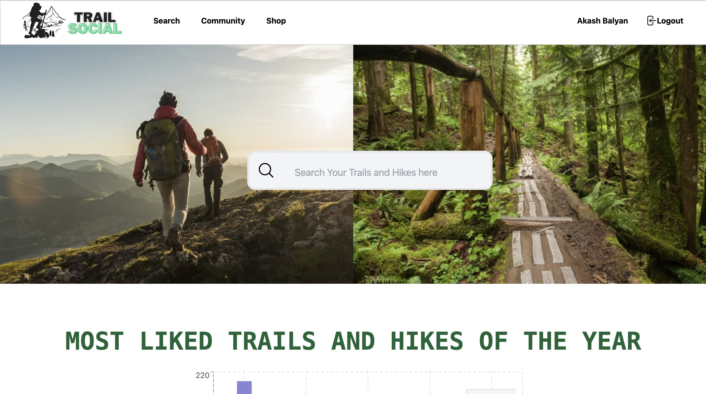
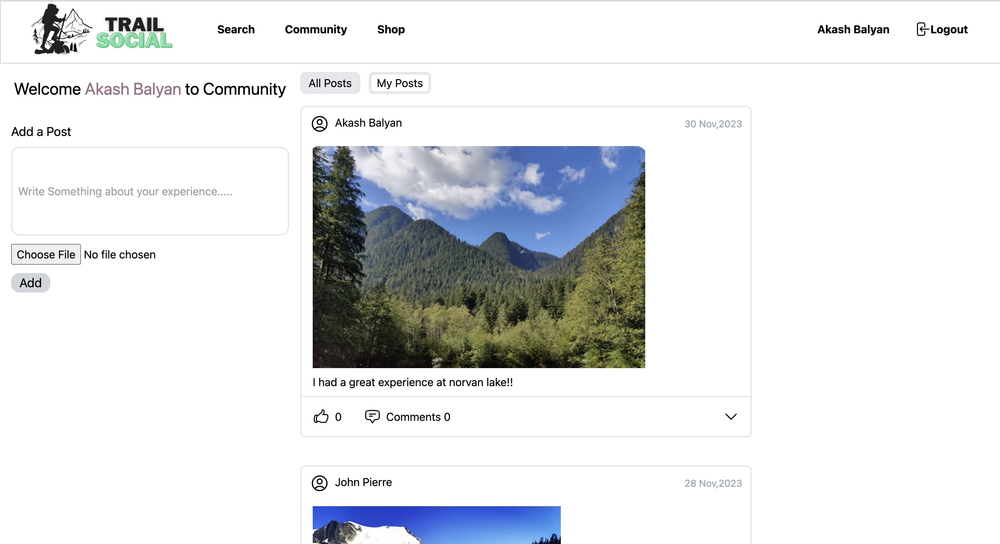
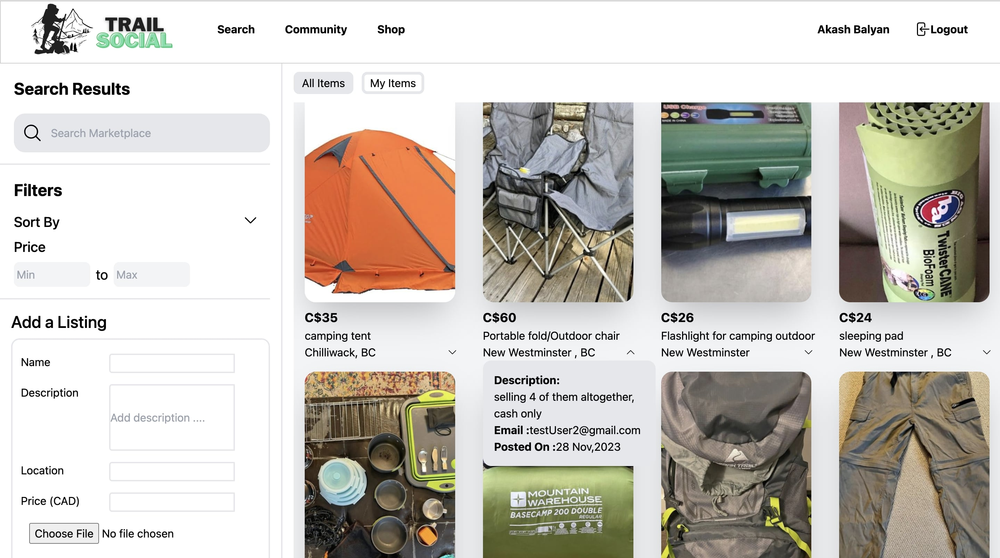
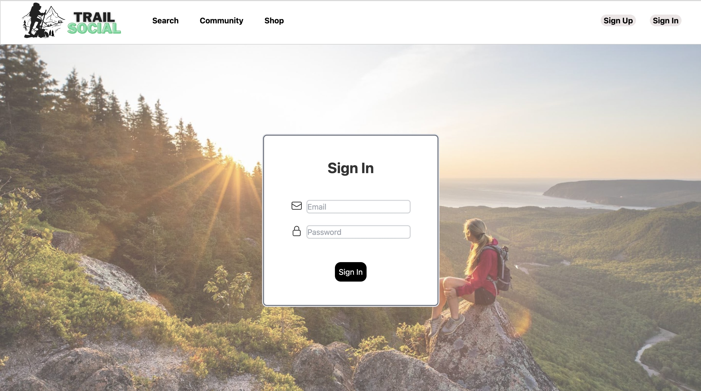
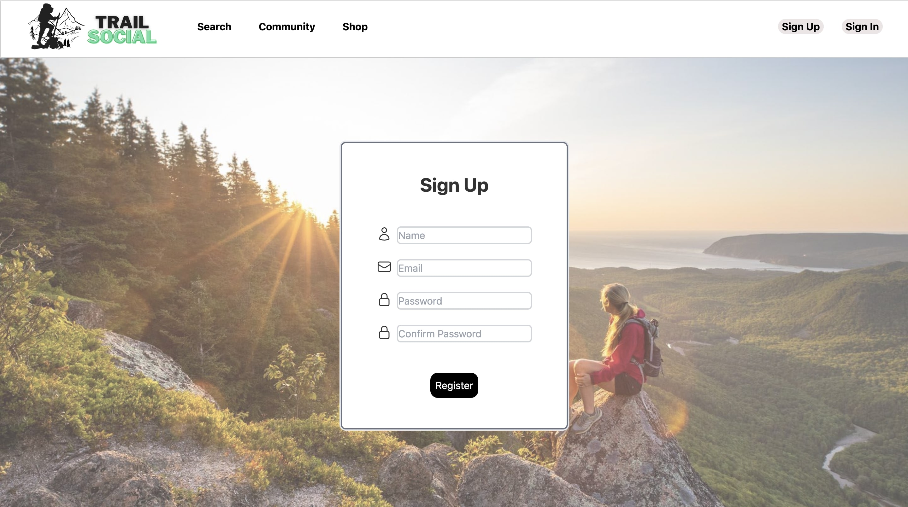

# TrailSocial  

TrailSocial is a social media platform designed for hiking and trekking enthusiasts to connect, share experiences, and trade trekking gear.  

## Features  

### Search for Trails  
- Users can search for nearby trails and hikes by entering the name of a location.  
- Get detailed trail information, including difficulty levels, distance, and reviews.  

### Social Interaction  
- Create an account and sign in to interact with the hiking community.  
- Post about your hiking experiences, upload pictures, and share tips.  
- Comment on and like others' posts to engage with the community.  

### Gear Marketplace  
- Explore the shop page to buy and sell trekking-related gear and equipment.  
- Safe and easy transactions to ensure quality experiences for all users.  

## Screenshots  

Here are some screenshots to give you a glimpse of TrailSocial in action:  

### Home Page  
 

### Community Page  
 

### Marketplace Page  

### Sign-In Page  

### Sign-Up Page  
 

